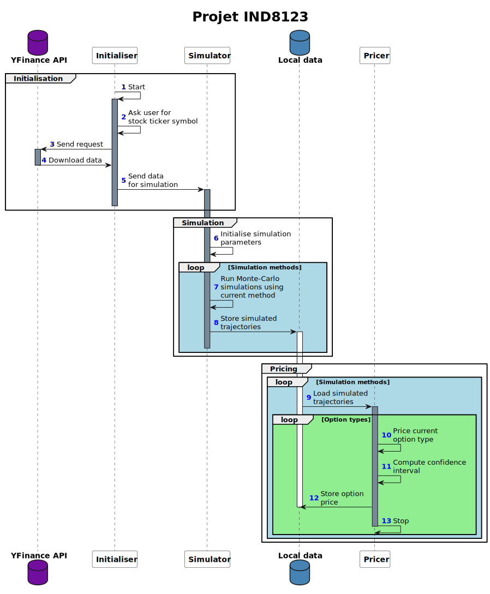

# Exotic options pricing project

This project aims to implement risk-neutral pricing for some of the most well-known exotic derivatives using
Monte-Carlo simulations.

## Requirements

This project uses the following python packages

```requirements
pandas>=2.2.3
numpy>=2.2.4
scipy>=1.15.2
yfinance>=0.2.55
```

## Specifications

The implemented call options are:

- Vanilla
- Asian arithmetic mean price
- Asian geometric mean price
- Knock-in
- Knock-out
- Lookback

We use three different Monte-Carlo simulation techniques:

- Naive simulations
- Variance reduction using antithetic variables

All simulations are based on geometric brownian motion modelling for stock prices
```math
dX_t=rXdt+\sigma XdW_t
```
Each time step of a trajectory is computed as follows, with $Z\sim\mathcal{N}(0,1)$ and $\sigma$ the historical volatility
```math
S_t=S_0e^{(r-\frac{1}{2}\sigma^2)t+\sigma\sqrt{t}Z}
```

## Configuration

In the [configuration file](config.ini), the user can modify the project parameters:

- The `option` parameters:
    - `strike_multiplier` is what is used to compute the strike price (by multiplying the initial price)
    - `knock_in_barrier_multiplier` is what is used to compute the knock-in barrier
    - `knock_out_barrier_multiplier` is what is used to compute the knock-out barrier
- The `simulation` parameters:
    - `trading_days` the number of trading days
    - `risk_free_rate` the risk-free rate
    - `use_seed` boolean to indicate if a seed should be used for random generations
    - `seed` the seed value
    - `horizon` option maturity in years
    - `n_trajectories` number of simulated trajectories
    - `n_strata` number of stratas for stratified sampling
    - `antithetic_proportion` proportion of antithetic variables to generate

## Functioning

For each trajectory, the program will compute it's future cash-flow at T $CF_T$.
The value of the option is then computed by discounting the expected cash-flow at the risk-free
rate
```math
C=e^{-rT}\mathbb{E}[CF_T]
```

The results are printed in the console and saved in the data folder under `prices.csv`.

## Sequence diagram

You can find the different sequence diagrams versions here
- [Plant UML file](docs/sequence.puml)
- [PDF file](docs/sequence.pdf)
- [SVG file (displayed belowed)](docs/sequence.svg)



## Example output

Here is an example output of the program with the user inputing stock ticker `AAPL` (Apple)


```shell
Loading configuration
Fetching data
Enter ticker symbol: AAPL
[*********************100%***********************]  1 of 1 completed

Executing simulations
	Executing Naive Monte-Carlo simulation
	Executing Antithetic variables Monte-Carlo simulation

Pricing options using naive simulation
	Pricing vanilla option
	Pricing asian arithmetic mean price option
	Pricing asian geometric mean price option
	Pricing knock-in barrier option
	Pricing knock-out barrier option
	Pricing lookback option

Pricing options using antithetic simulation
	Pricing vanilla option
	Pricing asian arithmetic mean price option
	Pricing asian geometric mean price option
	Pricing knock-in barrier option
	Pricing knock-out barrier option
	Pricing lookback option

Results:
        Option type Naive simulation Antithetic simulation
1           vanilla            7.994                 6.251
2  asian_arithmetic            2.188                 1.618
3   asian_geometric            2.031                 1.508
4          knock_in           29.797                 27.85
5         knock_out            6.964                 5.675
6          lookback           27.793                27.016

Confidence intervals:
        Option type Naive simulation Antithetic simulation
1           vanilla   [ 7.87,  8.12]        [ 6.15,  6.36]
2  asian_arithmetic   [ 2.14,  2.24]        [ 1.58,  1.66]
3   asian_geometric   [ 1.99,  2.08]        [ 1.47,  1.55]
4          knock_in   [29.43, 30.16]        [27.48, 28.22]
5         knock_out   [ 6.86,  7.07]        [ 5.58,  5.77]
6          lookback   [27.61, 27.97]        [26.85, 27.18]
```
